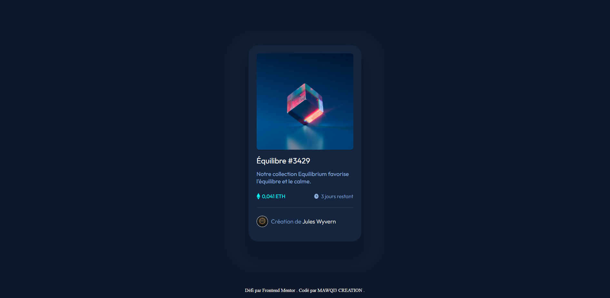
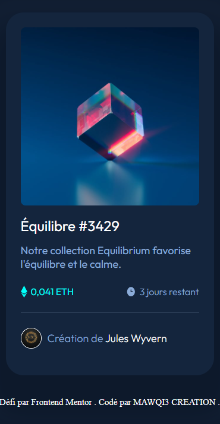

# Frontend Mentor - Solution carte NFT

Il s'agit d'une solution au [défi carte NFT sur Frontend Mentor] (hhttps://www.frontendmentor.io/challenges/nft-preview-card-component-SbdUL_w0U). Les défis Frontend Mentor vous aident à améliorer vos compétences en codage en réalisant des projets réalistes. 

## Table des matières

- Aperçu](#overview)
  - Capture d'écran](#screenshot)
  - Liens](#liens)
- Mon processus](#my-process)
  - Construit avec](#built-with)
  - Ce que j'ai appris](#what-i-learned)
- Auteur](#auteur)

## Aperçu

### Capture d'écran

### Liens

- Solution URL: (https://github.com/m3c-git/carte-nft)
- Live Site URL: (https://m3c-git.github.io/carte-nft)

## Mon processus

### Construit avec

- Balisage sémantique HTML5
- Propriétés SCSS personnalisées
- Google font

### Ce que j'ai appris

Ce defi m'a permis de mettre en pratique la syntaxe SCSS via SASS J'ai pu également travailler la propriété box-shadow. 

## Auteur

- Site Web - [MAWQI3 CREATION] (https://www.mawqi3creation.com)
- Instagram - [@mawqi3_creation] (https://www.instagram.com/mawqi3_creation)
- Frontend Mentor - [@m3c-git] (https://www.frontendmentor.io/profile/m3c-git)